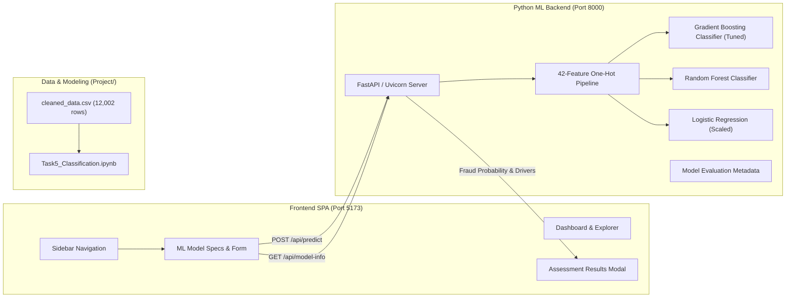

# Vehicle Insurance Fraud Intelligence Platform

A comprehensive, full-stack machine learning analytics platform that connects an interactive web frontend with a high-performance Python Machine Learning backend for real-time fraud classification and claim risk analysis.

---

## Architecture Overview



---

## Features & Integration

### 1. Connected Frontend & Backend
- **Real-Time API Communication**: The frontend sends 27 claim particulars (`POST /api/predict`) to the Python FastAPI backend.
- **Model Inference**: Claims are transformed into the exact 42-feature encoded schema matching the model training pipeline (`cleaned_data.csv`) and evaluated using the trained `GradientBoostingClassifier`.
- **Live Health Polling**: The frontend sidebar badge and footer status automatically query `GET /api/health` and show live status (`Backend Connected :8000`).
- **Explainable AI (XAI)**: Predictions return specific decision drivers (claim volume, safety profile, police report verification, driver liability).

### 2. Sidebar "ML Model" Tab Information
Clicking **ML Model** in the sidebar reveals:
1. **Performance KPIs**:
   - **Accuracy**: `77.7%` (Test Set Accuracy, 2,401 evaluated claims)
   - **Fraud Precision**: `84.6%` (High specificity; minimal false positive rate)
   - **CV F1-Score**: `0.2103 ± 0.0247` (Ranked #1 in 5-Fold Stratified K-Fold CV)
   - **Dataset Volume**: `12,002 Claims` (42 one-hot features, 80/20 train/test split)
2. **Model Comparison & Benchmark Table (Task 5)**:
   - Full comparative evaluation across **5 algorithms**:
     - **Gradient Boosting Classifier**: Test Acc `77.68%`, Precision `84.62%`, Recall `11.19%`, F1 `0.1976`, 5-Fold CV F1 `0.2103 ± 0.0247` (**Selected Champion**)
     - **Random Forest Classifier**: Test Acc `77.76%`, Precision `90.00%`, Recall `10.68%`, F1 `0.1909`, 5-Fold CV F1 `0.2085 ± 0.0220` (*Overfitting*)
     - **Logistic Regression**: Test Acc `77.59%`, Precision `84.21%`, Recall `10.85%`, F1 `0.1922`, 5-Fold CV F1 `0.2077 ± 0.0195` (*Good fit*)
     - **AdaBoost Classifier**: Test Acc `77.76%`, Precision `91.18%`, Recall `10.51%`, F1 `0.1884`, 5-Fold CV F1 `0.2026 ± 0.0206` (*Good fit*)
     - **Decision Tree Classifier**: Test Acc `77.43%`, Precision `85.29%`, Recall `9.83%`, F1 `0.1763`, 5-Fold CV F1 `0.2034 ± 0.0210` (*Good fit*)
3. **Confusion Matrix (Test Set N = 2,401)**:
   - True Negatives: `1,799` (Legitimate claims approved)
   - False Positives: `12` (Low false alarm rate)
   - False Negatives: `524` (Uncaptured fraud)
   - True Positives: `66` (Confirmed fraud detected)
4. **Top Feature Importances (Gini Weights)**:
   - Annual Income (`71.2%`)
   - Injury Claim Amount (`5.1%`)
   - Total Claim Amount (`3.5%`)
   - ZIP Code Risk Zone (`3.2%`)
   - Days Open Before Filing (`2.8%`)
   - Age of Driver (`2.5%`)
   - Safety Rating (`2.5%`)
   - Vehicle Market Price (`2.3%`)
5. **Interactive Live Claim Assessment**:
   - Model selection dropdown (`Gradient Boosting`, `Random Forest`, `Logistic Regression`).
   - Quick presets:
     - `⚡ Preset: High-Risk Suspicious Claim`
     - `🛡️ Preset: Clean Legitimate Claim`
   - Form submission connects directly to `http://127.0.0.1:8000/api/predict`.

---

## How to Run

### Option A: 1-Click Startup (Windows)
Double-click [`start.bat`](file:///d:/SEM-5/ML/Final_ML_Project/start.bat) in the project root.

### Option B: Manual Startup

1. **Start the Python Backend**:
   ```bash
   python run_server.py
   ```
   Backend will run at `http://127.0.0.1:8000` (Swagger docs at `http://127.0.0.1:8000/docs`).

2. **Start the Frontend**:
   ```bash
   cd Front-end
   npm run dev
   ```
   Frontend will run at `http://localhost:5173`.

---

## API Endpoints Reference

| Method | Endpoint | Description |
|---|---|---|
| `GET` | `/api/health` | Service health, loaded models, active model, uptime |
| `GET` | `/api/model-info` | Complete evaluation metrics, comparison table, confusion matrix, top features |
| `GET` | `/api/models` | List of available classification models for inference |
| `POST` | `/api/predict` | Predicts claim fraud probability, risk level, confidence, and decision factors |
